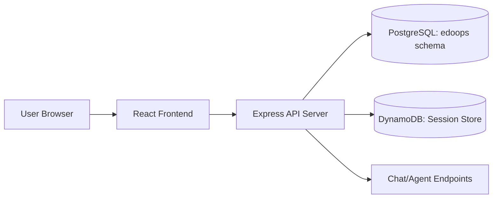

# Architecture Overview

## Purpose
This document set describes the runtime architecture of the DataOps dashboard application, including frontend, backend APIs, data sources, chat session persistence, and deployment options.

## System Context
The solution has two primary runtime layers:

1. Frontend application (React + TypeScript + Vite)
2. Backend API layer (Express + TypeScript)

The backend reads operational data from PostgreSQL-backed sources and persists chat session history in DynamoDB.

## High-Level Topology

## Core Capabilities

- Executive and domain dashboards (ServiceNow, ESP, DMF, Talend, Snowflake)
- Agent chat per domain
- Persistent chat history by session and agent
- Mock/live data switching for demos and development
- Local development and AWS serverless deployment paths

## Documentation Map

- 01-Component-View.md: frontend/backend component breakdown
- 02-Data-Flow-and-Session-Model.md: request lifecycle and session persistence model
- 03-Deployment-and-Operations.md: deployment options, environment configuration, and diagnostics

## Source of Truth

This documentation reflects code currently in:

- client/src
- server/src
- template.yaml
- lambdas/
- deploy.sh

For business-specific SQL details, refer to:

- ESP_Dashboard_Queries.md
- DMF_Dashboard_Queries.md
- ServiceNow_Dashboard_Queries.md
- Talend_Dashboard_Queries.md
