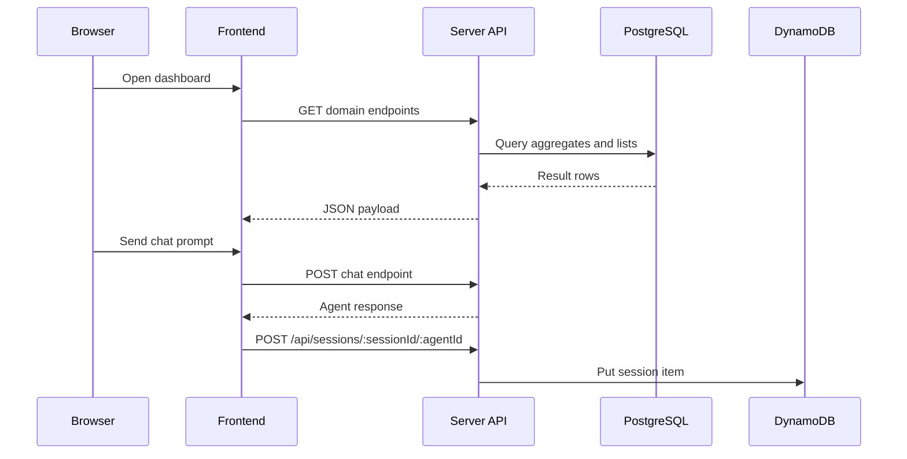

# Component View

## Frontend (client)

### Key Responsibilities

- Render dashboard tabs and domain widgets
- Provide floating and full-screen chat interfaces
- Manage UI state for filters, layouts, and navigation
- Call backend APIs for dashboard and session data

### Notable Modules

- client/src/App.tsx
  - Top-level orchestration for views and navigation state
- client/src/components/dashboard/
  - Dashboard tabs and domain-specific widgets
- client/src/components/chat/ChatPanel.tsx
  - Chat interaction, hydration, and session save triggers
- client/src/components/layout/Navigation.tsx
  - Sidebar navigation and mode toggles
- client/src/services/
  - API clients and session utilities

### Session Identity Behavior

- Session ID is created/read in client/src/services/session.ts
- Session ID is stored in browser sessionStorage under dataops-session-id
- Same browser tab reuses the same session ID until tab close

## Backend (server)

### Key Responsibilities

- Expose JSON API endpoints
- Execute SQL queries for domain dashboards
- Persist and retrieve chat session history in DynamoDB
- Provide diagnostics for connectivity and schema behavior

### Route Modules

- server/src/routes/esp.ts
- server/src/routes/servicenowDb.ts
- server/src/routes/dmfDb.ts
- server/src/routes/talendDb.ts
- server/src/routes/postgresDb.ts
- server/src/routes/session.ts

### Session Route Highlights

- GET /api/sessions/:sessionId/:agentId
- POST /api/sessions/:sessionId/:agentId
- DELETE /api/sessions/:sessionId/:agentId
- Diagnostic endpoints under /api/sessions/diagnostic/*
- Bulk endpoint: POST /api/sessions/bulk

## Data Stores

### PostgreSQL

Used for operational dashboard data, primarily from edoops schema tables.

### DynamoDB

Used for chat history persistence with key schema discovered at runtime by backend session routes.

## Chat and Agent Layer

- Frontend sends user message and current session context
- Backend proxies/processes chat endpoint responses
- Chat history is saved asynchronously to session API and rehydrated when agent view opens

## Runtime Interaction Summary

